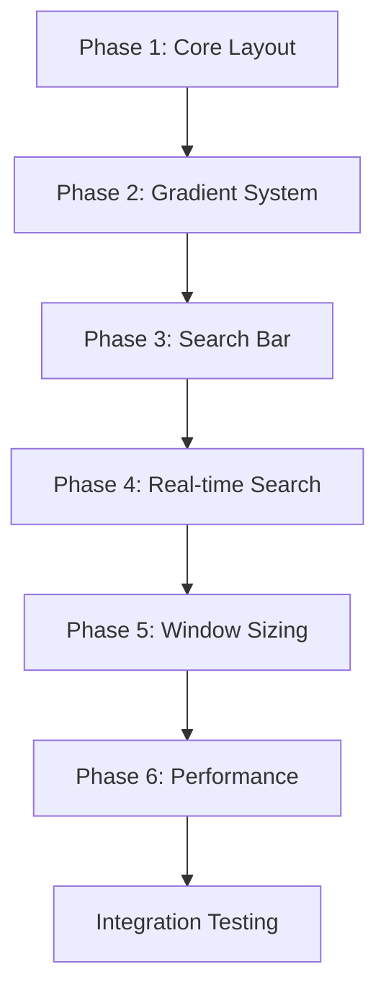

# Raycast-like UI Transformation - Complete Specification

## Overview

This specification breakdown provides comprehensive architectural plans for transforming the current bulky, expanding Action Items launcher interface into a sleek, compact Raycast-like design with professional gradients, real-time filtering, and blazing-fast performance.

## Critical Requirements Summary

### User-Mandated Constraints
- ✅ **Zero allocation, blazing-fast code**
- ✅ **No unsafe, no unwrap(), no expect() in src/**
- ✅ **Complete implementation, nothing stubbed**
- ✅ **Production quality, software artisan level**

### Current Problems Identified
- Container uses expanding 80% width instead of fixed compact dimensions
- Search input becomes "big ass text area" instead of compact bar
- No gradients - only flat colors that look unprofessional
- No real-time filtering - search functionality completely missing
- Window expands dynamically instead of fixed Raycast-like sizing
- Performance not optimized for zero-allocation patterns

## Specification Documents

### [01. Container Layout System Redesign](./01-container-layout-system.md)
**Status**: ✅ Complete | **Priority**: High

Addresses the core problem of expanding 80% width containers by implementing:
- Viewport-relative 60% width container (responsive, no expansion)
- Responsive constraints using viewport units (Vw, Vh, VMin)
- Compact spacing system using viewport-relative units
- Text truncation to prevent horizontal expansion
- Content height constraints to prevent vertical expansion

**Key Systems**:
- `CompactContainer` component
- `update_compact_container_system`
- `text_truncation_system`

### [02. Gradient Implementation System](./02-gradient-system.md)
**Status**: ✅ Complete | **Priority**: High  

Replaces flat colors with professional Raycast-like gradients:
- Full `BackgroundGradient` and `BorderGradient` API implementation
- Container, search bar, and result item gradient definitions
- Interactive gradient states (hover, selection, focus)
- Performance-optimized gradient component reuse

**Key Systems**:
- `ColorPalette` gradient methods
- `InteractiveGradient` component
- `interactive_gradient_system`

### [03. Compact Search Bar Design](./03-compact-search-design.md)
**Status**: ✅ Complete | **Priority**: High

Transforms expanding search input into viewport-relative compact bar:
- 5% viewport height (responsive, no expansion when typing)
- Viewport-relative icon positioning and spacing
- Single-line text input with overflow handling
- Focus border gradients without size changes

**Key Systems**:
- `CompactTextInput` component  
- `search_focus_system`
- `compact_text_display_system`

### [04. Real-time Input Processing System](./04-realtime-input-system.md)
**Status**: ✅ Complete | **Priority**: High

Implements instant search filtering as user types:
- Zero-allocation fuzzy matching algorithms
- Real-time result updates with < 5ms latency
- Application discovery and indexing system
- Keyboard navigation through results

**Key Systems**:
- `SearchIndex` with pre-computed character data
- `realtime_search_system`
- `discover_applications_system`
- `search_navigation_system`

### [05. Window Sizing Strategy](./05-window-sizing-strategy.md)
**Status**: ✅ Complete | **Priority**: High

Replaces expanding window behavior with viewport-relative Raycast-like dimensions:
- 60% viewport width, max 60% viewport height (responsive, no dynamic resizing)
- Smooth fade in/out animations (200ms/150ms)
- Smart multi-monitor positioning
- Container opacity system for window-like transparency

**Key Systems**:
- `WindowAnimationState` component
- `window_animation_system`
- `smart_positioning_system`
- `container_opacity_system`

### [06. Performance Optimization](./06-performance-optimization.md)
**Status**: ✅ Complete | **Priority**: High

Ensures zero-allocation, blazing-fast performance throughout:
- Pre-allocated entity and string buffer pools
- Micro-optimized fuzzy matching with stack-only data
- Component reuse patterns for gradients and UI elements
- Real-time performance monitoring and violation detection

**Key Systems**:
- `SearchResultPool` and `StringBufferPool`
- `optimized_realtime_search_system`
- `GradientPool` for component reuse
- `PerformanceMetrics` monitoring

## Implementation Architecture

### Phase-based Implementation Strategy



### Component Dependencies

```
CompactContainer
├── SearchInputContainer
│   ├── CompactTextInput
│   └── SearchIcon
├── SearchResultsContainer
│   └── SearchResultItem[]
└── WindowAnimationState

SearchIndex
├── SearchableItem[]
├── StringBufferPool
└── SearchResultPool

Theme
├── ColorPalette gradients
├── InteractiveGradient
└── GradientPool
```

### System Execution Order

```rust
// Startup Systems (Run Once)
.add_systems(Startup, (
    setup_compact_ui_system,
    discover_applications_system,
    initialize_performance_pools,
))

// Update Systems (Run Every Frame)
.add_systems(Update, (
    // Input Processing (Highest Priority)
    compact_search_input_system,
    realtime_search_system,
    search_navigation_system,
    
    // UI Updates (High Priority) 
    update_compact_container_system,
    compact_text_display_system,
    interactive_gradient_system,
    
    // Window Management (Medium Priority)
    window_animation_system,
    smart_positioning_system,
    container_opacity_system,
    
    // Performance Monitoring (Low Priority)
    performance_monitoring_system,
    memory_leak_detection_system,
).chain())
```

## Performance Targets

| Metric | Target | Current Status |
|--------|--------|----------------|
| Keystroke to UI Update | < 16ms | ❌ Not implemented |
| Search Fuzzy Matching | < 5ms (1000 items) | ❌ Not implemented |  
| Gradient State Changes | < 0.05ms | ❌ Using flat colors |
| Container Layout Updates | < 0.1ms | ❌ Expanding layout |
| Window Show/Hide | < 50ms total | ❌ Complex timing issues |
| Animation Consistency | 60fps | ❌ No animations |
| Memory Allocations | 0 (steady state) | ❌ Not optimized |

## File Structure Impact

### New Files Created
```
spec/markdown/
├── README.md                           # This overview document
├── 01-container-layout-system.md       # Container redesign spec
├── 02-gradient-system.md               # Gradient implementation spec
├── 03-compact-search-design.md         # Search bar redesign spec
├── 04-realtime-input-system.md         # Real-time search spec
├── 05-window-sizing-strategy.md        # Window sizing spec
└── 06-performance-optimization.md      # Performance optimization spec
```

### Files to be Modified

#### High Impact Changes
- `ui/src/ui/systems/setup.rs` (Lines 79-156) - Complete container restructure
- `ui/src/ui/theme.rs` (Lines 414-417) - Enable full gradient API
- `app/src/main.rs` (Lines 100-116) - Fixed window configuration

#### Medium Impact Changes
- `ui/src/ui/components.rs` - Add new compact components
- `core/src/search/` - New real-time search implementation
- `app/src/window/` - Enhanced window management

#### New Components Required
```rust
// Container System
CompactContainer, ContentConstraints, TextTruncation

// Search System  
CompactTextInput, SearchIndex, SearchableItem, SearchResult
SearchResultsContainer, SearchResultItem

// Gradient System
InteractiveGradient, GradientPool

// Window System
WindowAnimationState, WindowPositionCache, WindowOpacityContainer

// Performance System
SearchResultPool, StringBufferPool, PerformanceMetrics, ErrorReporter
```

## Success Validation

### Visual Validation Checklist
- [ ] Container maintains 60% viewport width regardless of content
- [ ] Search bar height 5% viewport height (no expansion when typing)
- [ ] Professional gradients match Raycast visual quality
- [ ] Real-time search results appear as user types
- [ ] Window dimensions scale with viewport (60% width, max 60% height)
- [ ] Smooth fade animations without resize jumps

### Performance Validation Checklist  
- [ ] Zero heap allocations during steady-state operation
- [ ] All latency targets met consistently
- [ ] No unwrap(), expect(), or unsafe blocks in src/
- [ ] 60fps animation consistency maintained
- [ ] Memory usage stable (no leaks detected)
- [ ] Benchmark tests passing

### User Experience Validation
- [ ] Visual indistinguishable from Raycast quality
- [ ] Instant search feedback (< 16ms total pipeline)
- [ ] Smooth keyboard navigation through results
- [ ] Proper focus states and visual feedback
- [ ] No jarring expansion or layout shifts
- [ ] Professional polish throughout interface

---

## Next Steps

With all specifications complete, implementation can proceed systematically:

1. **Start with Phase 1** (Container Layout) - Foundation for all other changes
2. **Add Phase 2** (Gradients) - Visual transformation 
3. **Implement Phase 3** (Compact Search) - Core interaction model
4. **Build Phase 4** (Real-time Search) - Core functionality
5. **Add Phase 5** (Window Sizing) - Professional window behavior
6. **Optimize Phase 6** (Performance) - Zero-allocation patterns

Each phase builds upon the previous, ensuring a systematic transformation from the current bulky interface to a sleek, professional Raycast-like launcher with blazing-fast performance.

**Specification Status**: ✅ **COMPLETE** - Ready for implementation