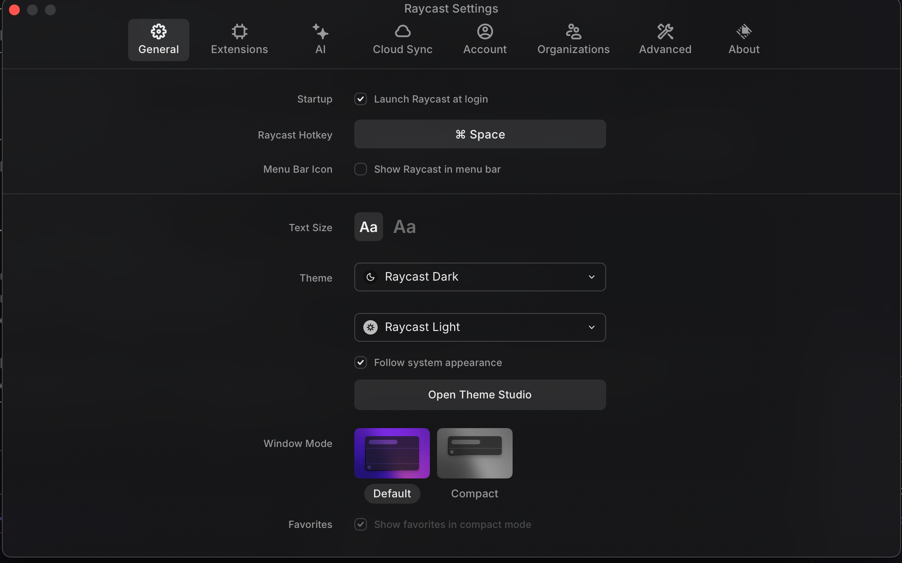

# TASK7.1: Settings Panel - General Tab UI Enhancement

**Status**: In Progress  
**Estimated Time**: 2-3 hours  
**Priority**: High  
**Dependencies**: ecs-settings infrastructure, ecs-user-settings database schema

---

## Objective

Enhance the General settings tab UI to match the Raycast reference design with proper visual styling, including styled text size buttons, icon-enhanced dropdowns, card-based window mode selection, and visual section separators.

---

## Current State Analysis

### ✅ Already Implemented

**Location:** [`packages/ecs-settings/src/ui/tabs/general.rs`](../packages/ecs-settings/src/ui/tabs/general.rs)

**Existing Infrastructure:**
- Event-driven architecture with SettingUpdateRequested events
- Database persistence via ecs-user-settings
- Tab switching and content management
- Form controls: checkboxes, dropdowns, text inputs
- Error display and validation feedback
- Systems for handling user interactions

**Current General Tab Sections:**
1. **Startup Section** ✓
   - Launch at Login checkbox
   - Global Hotkey field  
   - Show Menu Bar Icon checkbox

2. **Appearance Section** ✓
   - Text Size button group (shows "Small", "Medium", "Large" text)
   - Dark Theme dropdown
   - Light Theme dropdown
   - Follow System checkbox
   - Window Mode button group (shows "Compact", "Standard", "Full" text)

**Database Schema** ✓ ([`packages/ecs-user-settings/src/schema.rs`](../packages/ecs-user-settings/src/schema.rs))
- `startup_settings` table with launch_at_login, show_menu_bar_icon fields
- `appearance_settings` table with text_size, theme_dark, theme_light, follow_system_appearance, window_mode fields
- `hotkey_settings` table with hotkey_id, modifiers, key_code fields

### ❌ Needs Enhancement

Comparing current implementation to [screenshot reference](../spec/screenshots/General_Menu.png):

1. **Text Size Control** - Currently shows text labels ("Small", "Medium", "Large"), should show styled "Aa" buttons with different font sizes
2. **Theme Dropdowns** - Missing visual icons (moon for dark theme, sun for light theme)
3. **Window Mode Selection** - Uses simple button group, should use card-based selection with preview images
4. **Visual Separators** - Missing horizontal separator lines between sections
5. **Theme Studio Button** - Not present in current implementation
6. **Favorites Section** - Missing "Show favorites in compact mode" checkbox

---

## Screenshot Reference



**Visual Structure:**
```
┌─────────────────────────────────────────────────┐
│ [General] Extensions  AI  Cloud  Account  ...  │
├─────────────────────────────────────────────────┤
│                                                 │
│ Startup                                         │
│   ☑ Launch Raycast at login                    │
│                                                 │
│ Raycast Hotkey      [  ⌘ Space  ]             │
│                                                 │
│ Menu Bar Icon       ☐ Show Raycast in menu bar│
│                                                 │
│ ─────────────────────────────────────────────  │  ← Separator
│                                                 │
│ Text Size           [Aa]  [Aa]                 │  ← Styled buttons
│                           ^^^^                 │     (different sizes)
│ Theme              [🌙 Raycast Dark     ▼]     │  ← Icon in dropdown
│                    [☀️ Raycast Light    ▼]     │
│   ☑ Follow system appearance                   │
│   [ Open Theme Studio ]                        │
│                                                 │
│ Window Mode        ┌─────────┐  ┌─────────┐   │  ← Card selection
│                    │ ■■■■■■■ │  │ ▬▬▬▬▬▬▬ │   │     with previews
│                    │ Default │  │ Compact │   │
│                    └─────────┘  └─────────┘   │
│                                                 │
│ Favorites          ☑ Show favorites in compact │
│                                                 │
└─────────────────────────────────────────────────┘
```

---

## Implementation Requirements

### 1. Update Text Size Control

**File:** `packages/ecs-settings/src/ui/tabs/general.rs`

**Current Code (line ~42):**
```rust
y_offset = create_form_row(
    parent,
    "Text Size",
    |p, y| create_button_group(p, "text_size", APPEARANCE_SETTINGS, 
        vec!["Small", "Medium", "Large"], 1, y),
    y_offset
);
```

**Required Change:**
Replace text labels with styled "Aa" buttons showing different font sizes:

```rust
y_offset = create_form_row(
    parent,
    "Text Size",
    |p, y| {
        // Small "Aa" button
        p.spawn((
            UiLayout::window()
                .size((Ab(50.0), Ab(35.0)))
                .pos((Rl(CONTROL_OFFSET_PCT), Ab(y)))
                .pack(),
            UiColor::from(BUTTON_SECONDARY),
            UiHover::new().forward_speed(8.0),
            UiClicked::new().forward_speed(12.0),
            Text::new("Aa"),
            UiTextSize::from(Em(0.9)),  // Smaller font
            SettingControl {
                field_name: "text_size".to_string(),
                table: APPEARANCE_SETTINGS.to_string()
            },
            BorderRadius::all(Val::Px(6.0)),
            Pickable::default(),
            Name::new("TextSizeSmall"),
        ));
        
        // Large "Aa" button
        p.spawn((
            UiLayout::window()
                .size((Ab(50.0), Ab(35.0)))
                .pos((Rl(CONTROL_OFFSET_PCT) + Ab(60.0), Ab(y)))
                .pack(),
            UiColor::from(BUTTON_PRIMARY),  // Selected by default
            UiHover::new().forward_speed(8.0),
            UiClicked::new().forward_speed(12.0),
            Text::new("Aa"),
            UiTextSize::from(Em(1.3)),  // Larger font
            SettingControl {
                field_name: "text_size".to_string(),
                table: APPEARANCE_SETTINGS.to_string()
            },
            BorderRadius::all(Val::Px(6.0)),
            Pickable::default(),
            Name::new("TextSizeLarge"),
        ));
    },
    y_offset
);
```

### 2. Add Visual Section Separators

**Insert after Startup section:**
```rust
// Separator line
parent.spawn((
    UiLayout::window()
        .size((Rl(90.0), Ab(1.0)))
        .pos((Rl(5.0), Ab(y_offset)))
        .pack(),
    UiColor::from(Color::srgba(0.3, 0.3, 0.35, 1.0)),
    Name::new("SeparatorLine"),
));
y_offset += 20.0;
```

### 3. Add Theme Icons to Dropdowns

**Modify theme dropdowns to include icon glyphs:**
```rust
// Dark theme with moon icon
y_offset = create_form_row(
    parent,
    "Theme",
    |p, y| create_dropdown_with_icon(
        p, 
        "theme_dark", 
        APPEARANCE_SETTINGS, 
        vec!["Raycast Dark", "High Contrast", "Nord"], 
        0, 
        y,
        "🌙"  // Moon icon
    ),
    y_offset
);

// Light theme with sun icon
y_offset = create_form_row(
    parent,
    "",  // No label for second dropdown
    |p, y| create_dropdown_with_icon(
        p,
        "theme_light",
        APPEARANCE_SETTINGS,
        vec!["Raycast Light", "High Contrast", "Solarized"],
        0,
        y,
        "☀️"  // Sun icon
    ),
    y_offset
);
```

**Add helper function:**
```rust
fn create_dropdown_with_icon(
    parent: &mut ChildSpawnerCommands, 
    field_name: &str, 
    table: &str, 
    options: Vec<&str>, 
    selected: usize, 
    y_offset: f32,
    icon: &str
) {
    let options: Vec<String> = options.into_iter().map(|s| s.to_string()).collect();
    let selected_text = options.get(selected).cloned().unwrap_or_default();

    parent.spawn((
        UiLayout::window()
            .size((Rl(CONTROL_WIDTH_PCT), Ab(30.0)))
            .pos((Rl(CONTROL_OFFSET_PCT), Ab(y_offset)))
            .pack(),
        UiColor::from(INPUT_BG),
        UiHover::new(),
        UiClicked::new(),
        Text::new(format!("{} {}", icon, selected_text)),  // Icon + text
        DropdownControl {
            field_name: field_name.to_string(),
            options,
            selected,
            is_open: false
        },
        SettingControl {
            field_name: field_name.to_string(),
            table: table.to_string()
        },
        BorderRadius::all(Val::Px(6.0)),
        Pickable::default(),
    ));
}
```

### 4. Add Theme Studio Button

**After Follow System checkbox:**
```rust
// Open Theme Studio button
parent.spawn((
    UiLayout::window()
        .size((Rl(CONTROL_WIDTH_PCT), Ab(35.0)))
        .pos((Rl(CONTROL_OFFSET_PCT), Ab(y_offset)))
        .pack(),
    UiColor::from(Color::srgba(0.25, 0.25, 0.28, 1.0)),
    UiHover::new().forward_speed(8.0),
    UiClicked::new().forward_speed(12.0),
    Text::new("Open Theme Studio"),
    UiTextSize::from(Em(1.0)),
    BorderRadius::all(Val::Px(6.0)),
    Pickable::default(),
    ThemeStudioButton,  // Marker component
    Name::new("ThemeStudioButton"),
));
y_offset += 45.0;
```

### 5. Replace Window Mode with Card Selection

**Replace button group with card-based selection:**
```rust
y_offset += SECTION_SPACING;
y_offset = create_section_header(parent, "Window Mode", y_offset);

// Default mode card
parent.spawn((
    UiLayout::window()
        .size((Ab(140.0), Ab(110.0)))
        .pos((Rl(CONTROL_OFFSET_PCT), Ab(y_offset)))
        .pack(),
    UiColor::from(BUTTON_PRIMARY),  // Selected - blue border
    UiHover::new().forward_speed(8.0),
    UiClicked::new().forward_speed(12.0),
    BorderRadius::all(Val::Px(8.0)),
    SettingControl {
        field_name: "window_mode".to_string(),
        table: APPEARANCE_SETTINGS.to_string()
    },
    WindowModeCard { mode: WindowMode::Default },
    Pickable::default(),
    Name::new("WindowModeDefault"),
)).with_children(|card| {
    // Preview image placeholder (would load actual image)
    card.spawn((
        UiLayout::window()
            .size((Ab(120.0), Ab(70.0)))
            .pos((Ab(10.0), Ab(10.0)))
            .pack(),
        UiColor::from(Color::srgba(0.2, 0.2, 0.25, 1.0)),
        Name::new("DefaultPreview"),
    ));
    
    // Label
    card.spawn((
        UiLayout::window()
            .size((Ab(120.0), Ab(25.0)))
            .pos((Ab(10.0), Ab(85.0)))
            .pack(),
        Text::new("Default"),
        UiTextSize::from(Em(0.95)),
        Name::new("DefaultLabel"),
    ));
});

// Compact mode card (similar structure, positioned at x + 150)
// ... (repeat above with different position and mode)
```

**Add component:**
```rust
#[derive(Component)]
pub struct WindowModeCard {
    pub mode: WindowMode,
}

#[derive(Debug, Clone, Copy, PartialEq)]
pub enum WindowMode {
    Default,
    Compact,
}

#[derive(Component)]
pub struct ThemeStudioButton;
```

### 6. Add Favorites Section

**At the end:**
```rust
y_offset += SECTION_SPACING;
y_offset = create_section_header(parent, "Favorites", y_offset);
y_offset = create_form_row(
    parent,
    "Show favorites in compact mode",
    |p, y| create_checkbox(p, "show_favorites_in_compact", APPEARANCE_SETTINGS, true, y),
    y_offset
);
```

---

## System Updates

### Handle Window Mode Card Selection

**File:** `packages/ecs-settings/src/ui/systems.rs`

**Add system to handle card clicks:**
```rust
/// Handle window mode card selection
pub fn handle_window_mode_selection(
    mut query: Query<(&WindowModeCard, &Interaction, &mut UiColor, &SettingControl), Changed<Interaction>>,
    mut write_events: EventWriter<SettingUpdateRequested>,
    mut all_cards: Query<(&WindowModeCard, &mut UiColor)>,
    resource: Res<SettingsResource>,
) {
    for (card, interaction, mut color, control) in query.iter_mut() {
        if *interaction == Interaction::Pressed {
            // Update all cards - only selected one gets primary color
            for (other_card, mut other_color) in all_cards.iter_mut() {
                if std::ptr::eq(card, other_card) {
                    *other_color = UiColor::from(BUTTON_PRIMARY);
                } else {
                    *other_color = UiColor::from(BUTTON_SECONDARY);
                }
            }
            
            // Save to database
            let value = match card.mode {
                WindowMode::Default => Value::String("default".to_string()),
                WindowMode::Compact => Value::String("compact".to_string()),
            };
            
            write_events.write(SettingUpdateRequested::new(
                resource.current_tab,
                control.table.clone(),
                control.field_name.clone(),
                value,
                "ui_window_mode_card",
            ));
        }
    }
}
```

### Handle Theme Studio Button

**Add system:**
```rust
/// Handle theme studio button click
pub fn handle_theme_studio_click(
    query: Query<(&Interaction, &UiClicked), (With<ThemeStudioButton>, Changed<Interaction>)>,
) {
    for (interaction, clicked) in query.iter() {
        if *interaction == Interaction::Pressed && clicked.progress > 0.9 {
            info!("🎨 Opening Theme Studio (placeholder - implement theme editor)");
            // TODO: Emit event to open theme studio modal
            // ThemeStudioOpenRequested event would be handled by theme editor system
        }
    }
}
```

### Update Plugin Registration

**File:** `packages/ecs-settings/src/ui/plugin.rs`

**Add new systems:**
```rust
.add_systems(Update, (
    // ... existing systems ...
    handle_window_mode_selection,
    handle_theme_studio_click,
))
```

---

## Database Field Mapping

### startup_settings Table
```rust
{
    "launch_at_login": bool,          // Checkbox state
    "show_menu_bar_icon": bool,       // Checkbox state
}
```

### hotkey_settings Table
```rust
{
    "hotkey_id": "global_hotkey",     // Identifier
    "modifiers": ["Meta"],            // Array of modifier keys
    "key_code": "Space",              // Primary key
    "enabled": true,
}
```

### appearance_settings Table
```rust
{
    "text_size": "small" | "medium" | "large",
    "theme_dark": "Raycast Dark" | "High Contrast" | "Nord",
    "theme_light": "Raycast Light" | "High Contrast" | "Solarized",
    "follow_system_appearance": bool,
    "window_mode": "default" | "compact",
    "show_favorites_in_compact": bool,
}
```

---

## Definition of Done

The General tab is complete when:

1. ✅ **Visual Match to Screenshot**
   - Text size shows two "Aa" buttons with different font sizes
   - Theme dropdowns display with moon/sun icons
   - Window mode shows card-based selection with preview placeholders
   - Section separators appear between Startup, Appearance, Window Mode
   - Theme Studio button present
   - Favorites checkbox present

2. ✅ **Functional Requirements**
   - All controls save to correct database tables
   - Text size buttons toggle selection state (one selected at a time)
   - Window mode cards toggle selection (one selected at a time)
   - Theme Studio button responds to clicks (logs for now)
   - All existing functionality preserved (checkboxes, dropdowns, hotkey)

3. ✅ **Code Quality**
   - Helper functions reusable and well-documented
   - Components follow existing patterns in codebase
   - Systems integrated into plugin properly
   - No breaking changes to existing architecture

4. ✅ **Integration**
   - Works with existing event system (SettingUpdateRequested)
   - Database persistence via ecs-user-settings
   - Error display and validation still functional
   - Tab switching preserves state

---

## Implementation Notes

### DO:
- ✅ Reuse existing helper functions where possible
- ✅ Follow established patterns in general.rs
- ✅ Keep systems simple and focused
- ✅ Use constants from theme.rs for colors and spacing
- ✅ Test with actual database to verify persistence

### DON'T:
- ❌ Change the overall architecture or event system
- ❌ Replace working functionality with new implementations
- ❌ Add complex state management (keep it event-driven)
- ❌ Create separate resources for General tab (use existing SettingsResource)

### Key Files to Modify:
1. [`packages/ecs-settings/src/ui/tabs/general.rs`](../packages/ecs-settings/src/ui/tabs/general.rs) - Main UI updates
2. [`packages/ecs-settings/src/ui/systems.rs`](../packages/ecs-settings/src/ui/systems.rs) - Add window mode and theme studio handlers
3. [`packages/ecs-settings/src/ui/components.rs`](../packages/ecs-settings/src/ui/components.rs) - Add WindowModeCard and ThemeStudioButton components
4. [`packages/ecs-settings/src/ui/plugin.rs`](../packages/ecs-settings/src/ui/plugin.rs) - Register new systems

---

## References

### Existing Code Patterns
- Checkbox pattern: [`general.rs:75-115`](../packages/ecs-settings/src/ui/tabs/general.rs#L75-L115)
- Dropdown pattern: [`general.rs:145-185`](../packages/ecs-settings/src/ui/tabs/general.rs#L145-L185)
- Button group pattern: [`general.rs:205-240`](../packages/ecs-settings/src/ui/tabs/general.rs#L205-L240)
- Section header pattern: [`general.rs:60-70`](../packages/ecs-settings/src/ui/tabs/general.rs#L60-L70)

### Database Schema
- Schema definition: [`packages/ecs-user-settings/src/schema.rs`](../packages/ecs-user-settings/src/schema.rs)
- Table names: [`packages/ecs-user-settings/src/table_names.rs`](../packages/ecs-user-settings/src/table_names.rs)

### UI Constants
- Colors and sizing: [`packages/ecs-settings/src/ui/theme.rs`](../packages/ecs-settings/src/ui/theme.rs)

### Event System
- Event definitions: [`packages/ecs-settings/src/events.rs`](../packages/ecs-settings/src/events.rs)
- Event handling: [`packages/ecs-settings/src/ui/systems.rs`](../packages/ecs-settings/src/ui/systems.rs)

---

## Time Estimate

- Text size button styling: 20 minutes
- Section separators: 10 minutes  
- Theme dropdown icons: 15 minutes
- Theme Studio button: 15 minutes
- Window mode cards: 45 minutes
- Favorites section: 10 minutes
- System updates: 30 minutes
- Testing and refinement: 30 minutes

**Total: 2-3 hours**

---

## Success Criteria

**Ready for review when:**
- General tab visually matches screenshot reference
- All controls persist to database correctly  
- No console errors or warnings
- Existing functionality unchanged
- Code follows project conventions
- Changes isolated to General tab (no side effects)
